# Лабораторная работа 1

## Задание 1

### Классификация языков и представление кода
* **Языки низкого уровня** — языки для прямого написания программ под конкретное физическое устройство.
* **Исполняемый файл (исполняемый код)** — файл с набором элементарных инструкций для процессора и операционной системы.
* **Ассемблер** — язык программирования низкого уровня, в котором каждая инструкция физического устройства представлена в текстовом виде.
* **Язык высокого уровня** — язык, абстрагированный от команд процессора и удобный для чтения человеком.
* **Исходный код** — текст программы, написанной на языке высокого уровня.

### Спецификации и семантика
* **Виртуальная машина** — это средство описания семантики языка программирования.
* **Стандарт языка программирования** — документ, описывающий язык программирования максимально подробно и, по возможности, наиболее формально.

### Трансляция и её виды
* **Транслятор** — техническое средство, осуществляющее перевод текста программы с одного языка на другой.
* **Компилятор** — транслятор, полностью переводящий программу в машинный код для последующего запуска.
* **Интерпретатор** — транслятор, пошагово читающий и исполняющий программу по одной команде.
* **Псевдокомпилятор** — транслятор, переводящий программу в промежуточное представление (байт-код), который состоит из набора инструкций близких по смыслу к машинному коду.
* **Компилирующий интерпретатор** — транслятор, переводящий текст во внутреннее представление непосредственно при запуске.
* **REPL-интерпретатор** — программное средство, работающее в цикле чтения-вычисления-печати (Read-Eval-Print Loop).

### Этапы и инструменты жизненного цикла программы
* **Единица трансляции** — минимальный фрагмент программы, который может быть транслирован независимо от остального кода.
* **Препроцессинг (предобработка)** — начальный этап трансляции программы.
* **Объектный файл** — результат трансляции модуля (переходный элемент от текста программы к исполняемому файлу), содержащий команды на языке исполнителя и имена идентификаторов.
* **Сборка** — заключительный этап трансляции, результатом которого является исполняемый файл.
* **make** — утилита для управления процессом компиляции и сборки программ.

## Задание 2

### Навигация и управление панелями
* **Tab** — Переключение активной панели (между левой и правой).
* **Enter** — Вход в выбранную папку или запуск файла/команды.
* **Ctrl + PageUp** — Переход на один уровень вверх (в родительскую папку).
* **Alt + F1** — Выбор диска для левой панели.
* **Alt + F2** — Выбор диска для правой панели.

### Работа с файлами и папками
* **F7** — Создание новой папки (каталога).
* **Shift + F4** — Создание нового текстового файла и его мгновенное открытие.
* **F8** — Удаление файлов/папок в корзину.

### Просмотр и редактирование (Встроенный редактор)
* **F3** — Просмотр содержимого файла (без возможности изменения).
* **F4** — Открытие файла во встроенном текстовом редакторе.
* **F2** — Сохранение изменений при редактировании файла.

### Работа с командной строкой и поиск
* **Ctrl + O** — Скрыть или показать панели (для просмотра вывода компилятора или программы).
* **Alt + F8** — Открыть всплывающее меню со списком всей истории команд.
* **Alt + F7** — Быстрый поиск файлов на диске.

## Задание 3

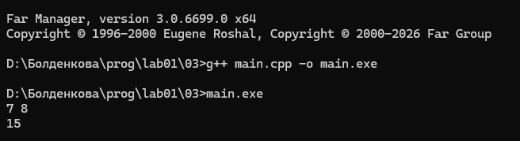

## Задание 4

### Успешная сборка программы из объектных файлов
Программа успешно запустилась и вывела сообщения в консоль

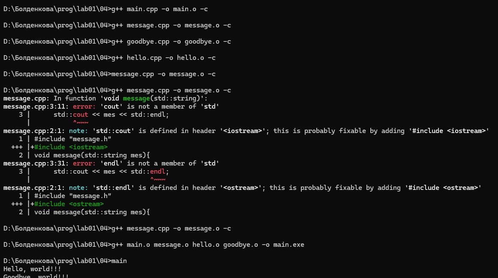

### Cинтаксическая ошибка
* **Вопрос:** Можно ли выполнить компиляцию одного файла, если другой содержит синтаксическую ошибку?

1. В файл `hello.cpp` была внесена синтаксическая ошибка (удалена точка с запятой):

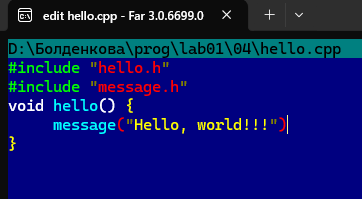

2. При этом соседний корректный файл `message.cpp` успешно скомпилировался в объектный файл `message.o` без каких-либо ошибок:

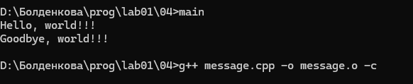

### Потеря объектного файла
* **Вопрос:** Что произойдет при сборке, если один из объектных файлов будет потерян?

1. Из рабочей директории был полностью удален объектный файл `goodbye.o`:

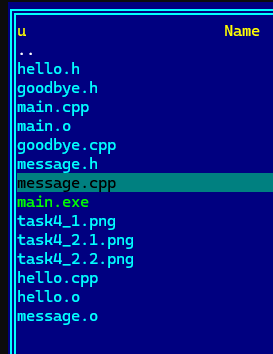

2. При попытке повторной сборки проекта выдается критическая ошибка об отсутствии файла:

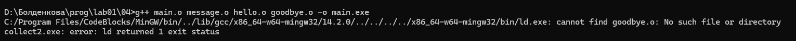

## Задание 5

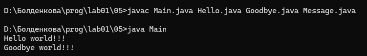

## Задание 6

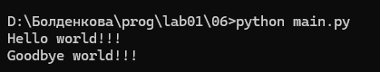

## Задание 7

Для автоматизации сборки многомодульного проекта на C++ был составлен файл `makefile`.

### Первоначальная сборка проекта
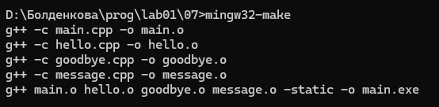

### Частичная пересборка при изменении одного модуля
При изменении файла `hello.cpp`:
 
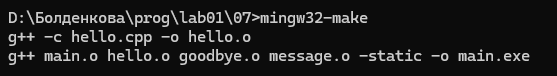

### Ошибка при потере исходных файлов
При отсутствии одного из исходных модулей сборка проекта становится невозможной:

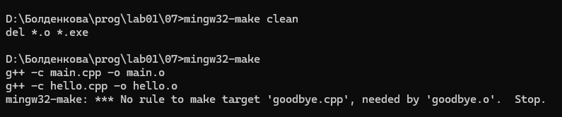

## Задание 8

### 1 и 2
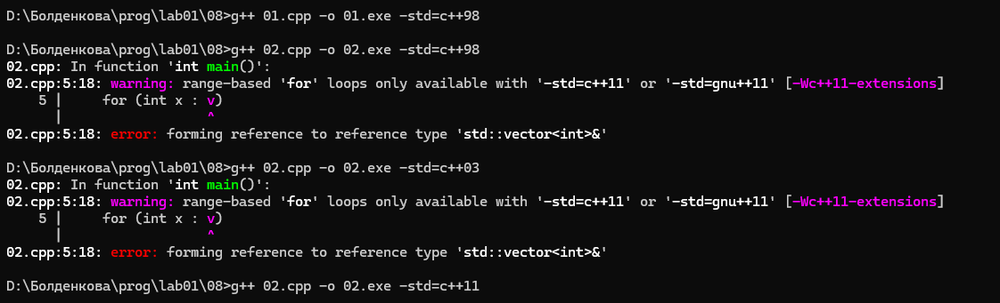

### 3
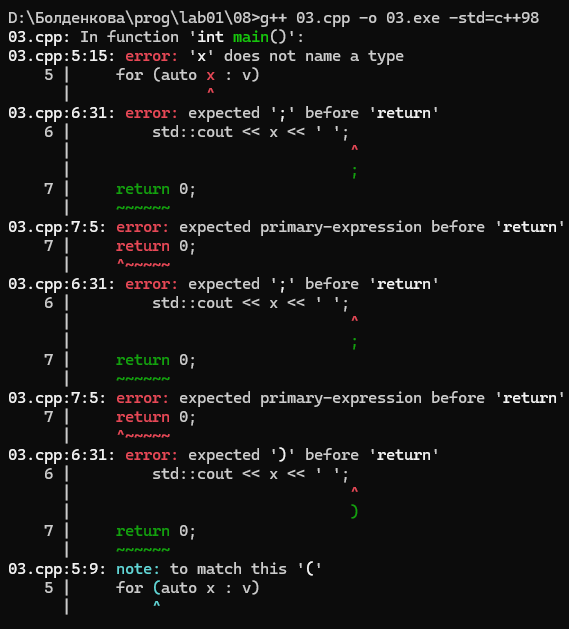
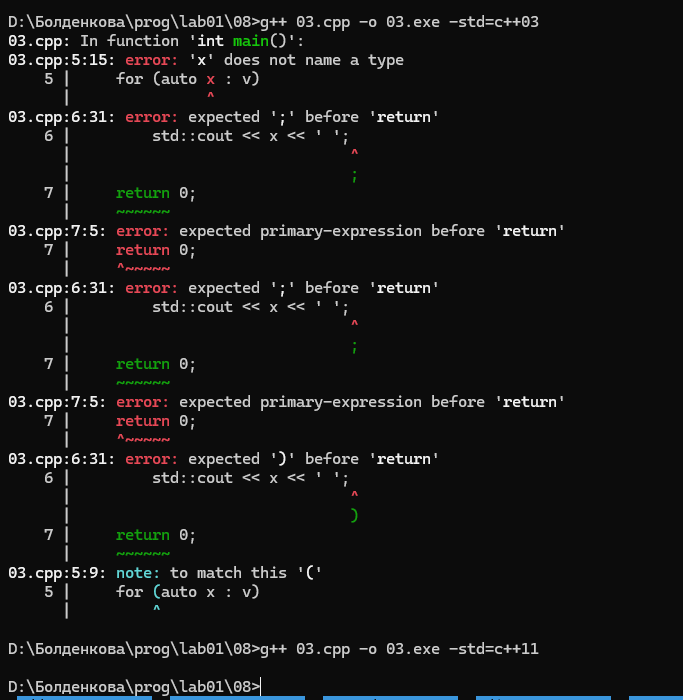

### 4
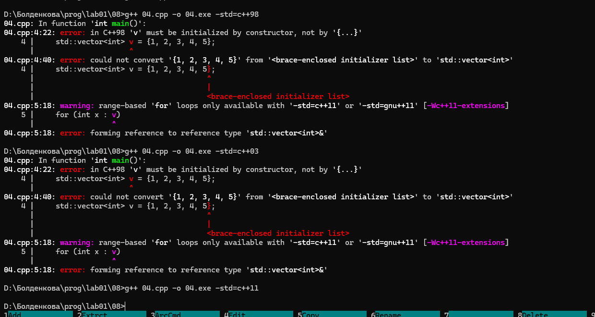

### 5
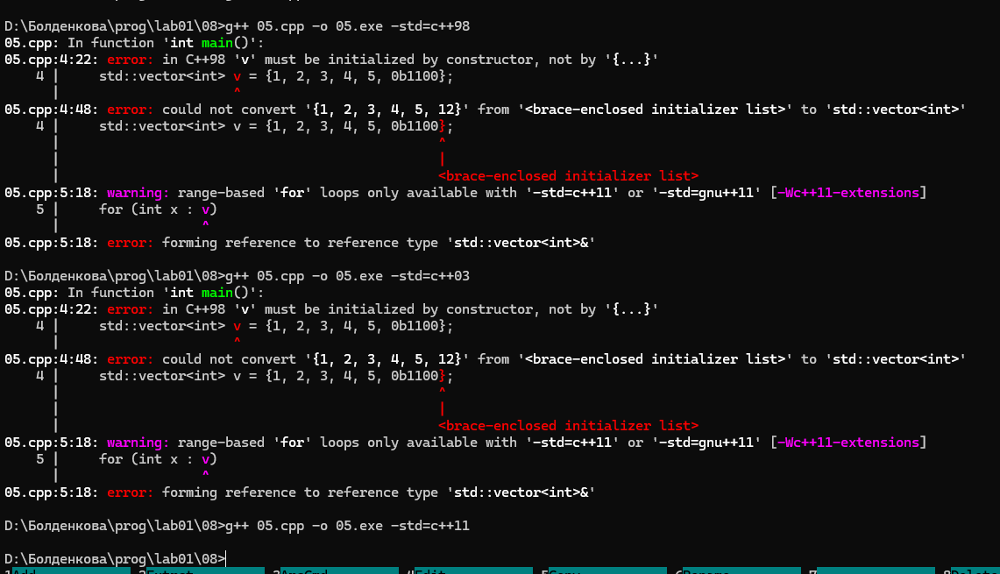

### 6
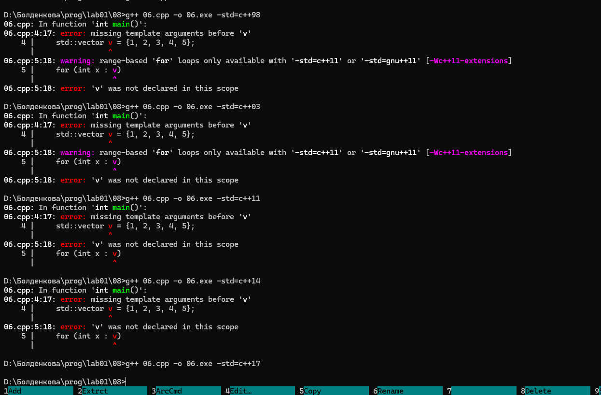

## Задание 9

Я создала три файла с ассемблерным кодом с помощью команд `-O0`, `-O1` и `-O2`. Потом я открыла их через Far Manager и сравнила, что находится внутри блока `main:`.

### Что я увидела в файлах:

1. **В файле без оптимизации (`main_O0.s`):**
   Компилятор записал программу точно так, как я её написала в коде. Там внутри четко виден долгий цикл: программа честно берет число, прибавляет его, потом проверяет счетчик, дошел ли он до 123, и так делает по кругу 123 раза. 

2. **В файлах с оптимизацией (`main_O1.s` и `main_O2.s`):**
   Здесь код сильно изменился. Компилятор понял, что складывать одно и то же число 123 раза — это очень долго. Поэтому он полностью стёр весь цикл со всеми проверками, а вместо него вставил одну простую команду умножения на 123.

### Мой вывод:
Оптимизатор в компиляторе сам делает программу быстрее. Он находит долгие места (например, циклы, где складывается одно и то же) и заменяет их на быстрые математические действия (на умножение).
