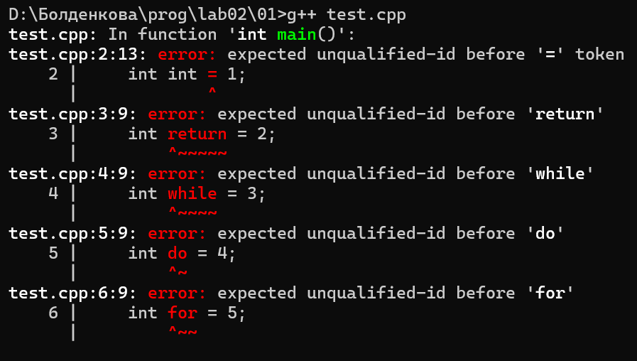
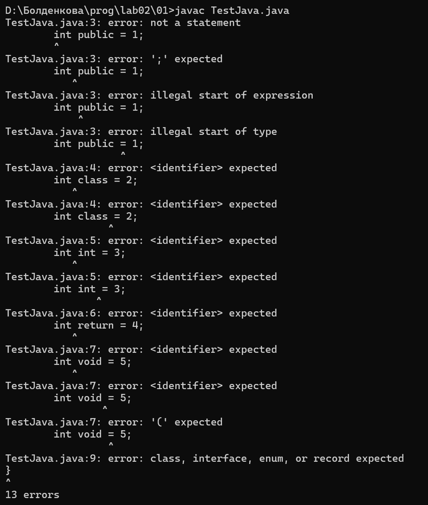
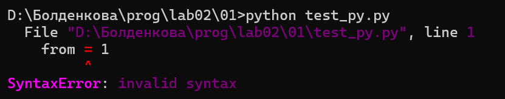
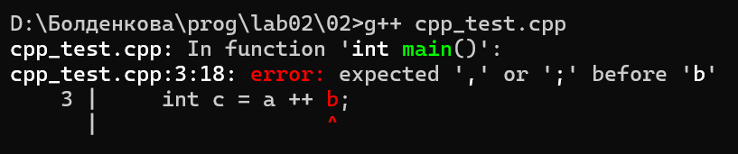
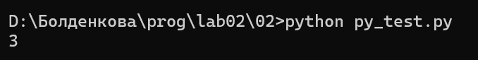
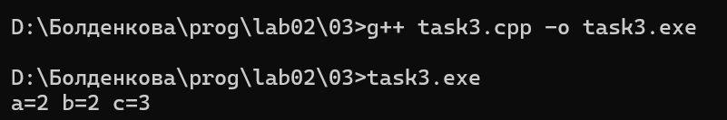
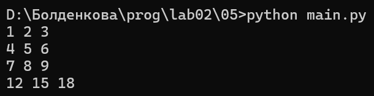

# Языки программирования
## Лабораторная работа 2
### Задание 1 **(2)**
Я выбрала по 5 ключевых слов для каждого языка и попробовала создать переменные с этими именами.

### 1. Проверка в C++ (слова: int, return, while, do, for)
При попытке скомпилировать код, компилятор `g++` выдал ошибки на каждую строчку, потому что эти слова зарезервированы системой.



### 2. Проверка в Java (слова: public, class, int, return, void)
При компиляции через `javac` программа выдала ошибки синтаксиса. Язык не разрешает использовать зарезервированные слова как имена объектов.


### 3. Проверка в Python (слова: from, import, for, in, def)
Интерпретатор Python сразу сломался на первой же строчке с ошибкой `SyntaxError: invalid syntax`.



**Вывод по заданию 1:** Создавать переменные с именами ключевых слов нельзя ни в одном из языков.

### Задание 2 **(2)**
### 1. Программа на C++
```cpp
int main() {
    int a=1, b=2;
    int c=a++b;
    return 0;
}
```
**Сообщение об ошибке от компилятора g++:**



Токенизатор С++ разбивает строчку на следующие токены: `int`, `c`, `=`, `a`, `++`, `b`, `;`. 
Оператор `++` (инкремент) является унарным и работает только с одной переменной. Здесь же токенизатор из-за отсутствия пробелов попытался вставить его как бинарный оператор между переменными `a` и `b`, что вызвало синтаксическую ошибку.

### 2. Программа на Python
```python
a=1
b=2
c=a++b
```
Программа успешно выполнилась без ошибок синтаксиса. Результат вывода переменной `c` равен `3`.



Токенизатор Python разбивает строчку на токены: `c`, `=`, `a`, `+`, `+`, `b`.
В языке Python вообще нет оператора `++`. Поэтому токенизатор разбил это место на два отдельных оператора унарного плюса подряд (`+` и `+`). Программа восприняла это как обычное математическое сложение переменной `a` с положительным числом `b` (`c = a + (+b)`).

### Задание 3 **(2)**
### Исходный код программы:
```cpp
#include <iostream>
int main() {
    int a = 1, b = 2;
    int c = a +++ b;
    std::cout << "a=" << a << " b=" << b << " c=" << c << std::endl;
    return 0;
}
```

### Результат запуска программы:
Программа успешно компилируется и выводит на экран значения: `a=2 b=2 c=3`.



Токенизатор С++ разбивает строчку `int c = a +++ b;` на следующие токены: `int`, `c`, `=`, `a`, `++`, `+`, `b`, `;`.

По правилу "жадного" лексического разбора, токенизатор объединяет первые два плюса в один максимальный оператор инкремента `++`, а третий плюс оставляет как знак сложения `+`. Выражение выполняется как `c = (a++) + b`. 

### Можно ли изменить разбиение, вставляя пробелы?
Да, можно. Пробелы играют роль разделителей токенов. Если мы принудительно поставим пробел после первого плюса (`a + ++ b`), то токенизатор будет обязан разбить строку по-другому: на токен сложения `+` и токен префиксного инкремента `++`. Выражение превратится в `c = a + (++b)`, и результат программы изменится на `a=1 b=3 c=4`.
### Задание 4 **(2)**

Одни и те же символы скобок могут быть как операторами, так и знаками пунктуации, в зависимости от контекста.

### 1. Круглые скобки `()`
* **Являются оператором:** В случае вызова функции или метода для передачи параметров.
  * *Пример:* `abs(a)`, `sin(i*x)`, `input()`. Здесь скобки выполняют оператор вызова.
* **НЕ являются оператором:** В случае изменения приоритета математических операций или при объявлении функций.
  * *Пример:* `(a < b)`, `(z - 1)`, `int main()`. Здесь скобки служат пунктуаторами.

### 2. Квадратные скобки `[]`
* **Являются оператором:** При обращении к элементу массива, вектора или коллекции по индексу.
  * *Пример:* `v[i]` — операция взятия `i`-го элемента из вектора `v`.
* **НЕ являются оператором:** При создании списков или синтаксических конструкций.
  * *Пример:* `[map(int, input().split()) for i in (1,2,3)]` — здесь квадратные скобки используются как пунктуаторы для обозначения границ генератора списка в Python.

### Задание 5 **(3)**

### Исходный код программы:
```python
print(*map(sum, zip(
    *[map(int, input().split()) for i in (1, 2, 3)]
)))
```

### Результат работы программы:
Программа принимает на вход три строки чисел, складывает их по вертикальным столбцам и выводит результат на экран.



### Классификация токенов в коде:
* **Ключевые слова:** `for`, `in`.
* **Идентификаторы функций/методов:** `print`, `map`, `sum`, `zip`, `int`, `input`, `split`.
* **Идентификаторы переменных:** `i`.
* **Литералы:** `1`, `2`, `3`.
* **Операторы:** `*` (оператор распаковки), круглые скобки `()` после имен функций — операторы вызова.

### Вызываемые функции и их параметры:
1. `input()` — параметров нет, возвращает строку текста от пользователя.
2. `split()` — вызывается у строки, параметров нет, возвращает список слов.
3. `int(значение)` — принимает строку, возвращает целое число.
4. `map(функция, последовательность)` — применяет функцию к каждому элементу.
5. `zip(*последовательности)` — принимает списки и группирует их по элементам.
6. `sum(последовательность)` — принимает набор чисел, возвращает их сумму.
7. `print(значения)` — выводит результат в консоль.

### Задание 6 **(2)**

Я проверила все 5 лекционных примеров на компьютере с помощью компилятора `g++`.

### Разбор примеров:

1. `cout <<" Hello /* Это комментарий */ world ";`
   * **Статус:** Ошибок нет.
   * **Как работает:** Знаки комментария находятся внутри двойных кавычек, поэтому токенизатор считает их частью обычного текста (строкового литерала) и не вырезает.

2. `// /*`  
   `Это комментарий` — *вызовет ошибку, если не поставить `//`*
   * **Статус:** Ошибок нет, если перед каждой строкой блока стоит `//`.
   * **Как работает:** Это стандартные однострочные комментарии.

3. `/* Я комментирую программы /* комментарий */ */`
   * **Статус:** СИНТАКСИЧЕСКАЯ ОШИБКА.
   * **Почему:** В C++ и Java запрещены вложенные многострочные комментарии. Первое же закрытие `*/` завершает весь комментарий, а оставшийся в конце хвостик `*/` вызывает ошибку трансляции.

4. `// Я комментирую программы /* комментарий */`
   * **Статус:** Ошибок нет.
   * **Как работает:** Знак `//` превращает всю строку до самого конца в комментарий, поэтому идущие следом символы `/*` ни на что не влияют.

5. `/* Я комментирую свои программы`  
   `// Это комментарий до конца строки */`  
   `*/`
   * **Статус:** СИНТАКСИЧЕСКАЯ ОШИБКА.
   * **Почему:** Символы `*/` во второй строке закрывают самый первый открывающий знак `/*`. Из-за этого `*/` на третьей строке становится лишним и ломает компиляцию.

### Задание 7 **(4)**

### 1. Первый вид — цикл `while`, который соответствует строке правила `while ( condition ) statement`
* Формат записи (по правилу): ключевое слово `while`, в круглых скобках условие `condition`, далее инструкция `statement`.

**Пример фрагмента программы:**
```cpp
int x = 1;
while (x < 1000) {
    cout << x;
    x *= 2;
}
```

### 2. Второй вид — цикл `do-while`, который соответствует строке правила `do statement while ( expression ) ;`
* Формат записи (по правилу): ключевое слово `do`, далее инструкция `statement`, ключевое слово `while`, в круглых скобках выражение `expression`, в конце пунктуатор `;`.

**Пример фрагмента программы:**
```cpp
int x = 1;
do {
    cout << x;
    x *= 2;
} while (x < 1000);
```

### 3. Третий вид — классический цикл `for`, который соответствует строке правила `for ( init-statement conditionopt ; expressionopt ) statement`
* Формат записи (по правилу): ключевое слово `for`, в круглых скобках начальная инструкция `init-statement`, необязательное условие `condition`, разделяющие точки с запятой `;`, необязательное выражение `expression`, далее инструкция `statement`.

**Пример фрагмента программы:**
```cpp
for (int i = 0; i < 10; i++) {
    cout << i;
}
```

### 4. Четвертый вид — цикл по коллекции (`range-based for`), который соответствует строке правила `for ( for-range-declaration : for-range-initializer ) statement`
* Формат записи (по правилу): ключевое слово `for`, в круглых скобках объявление переменной `for-range-declaration`, двоеточие `:`, выражение инициализатора коллекции `for-range-initializer`, далее инструкция `statement`.

**Пример фрагмента программы:**
```cpp
for (int x : v) {
    cout << x << ' ';
}
```

### Задание 8 **(3)**

Для математического выражения `a = -x + y * (z - 1)` было построено упрощенное абстрактное синтаксическое дерево.

### Текстовый граф дерева разбора выражения:

```text
         [ оператор = ]
          /          \
         a        [ оператор + ]
                   /          \
         [ унарный - ]      [ оператор * ]
              |              /          \
              x             y       [ оператор - ]
                                     /          \
                                    z            1
```

### Порядок вычисления по дереву:
1. Вычисляется операция вычитания `[ оператор - ]` над переменной `z` и литералом `1`.
2. Результат вычитания передается в операцию умножения `[ оператор * ]` с переменной `y`.
3. Параллельно вычисляется смена знака `[ унарный - ]` для переменной `x`.
4. Результаты унарного минуса и умножения складываются с помощью `[ оператор + ]`.
5. Финальное значение записывается в переменную `a` через `[ оператор = ]`.
